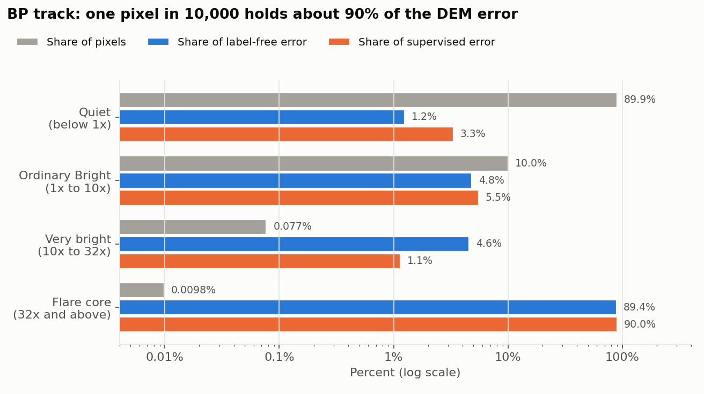
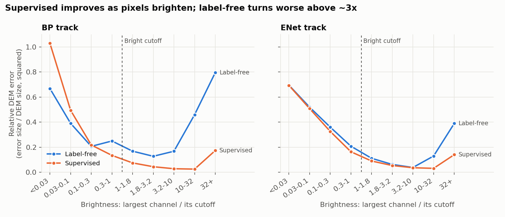
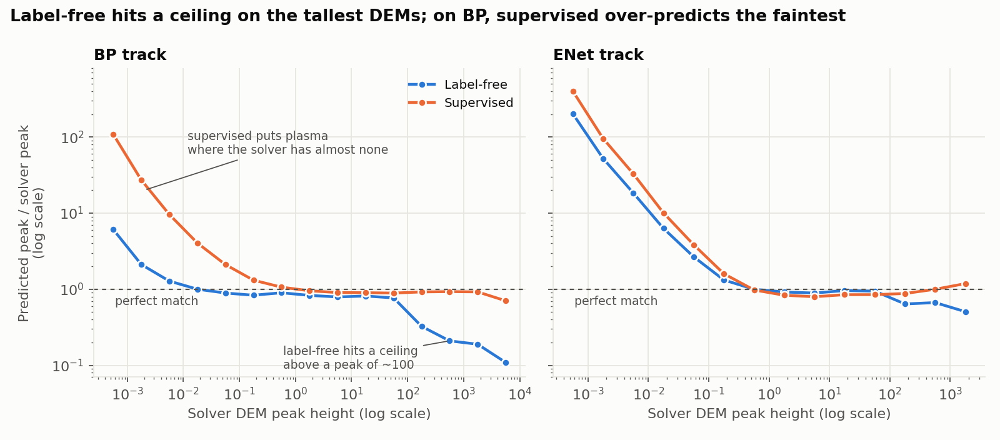

# Why the label-free model trails on Bright pixels

*Diagnostic write-up, 2026-09-29. Full shared test set (153 held-out timestamps), BP and matched ENet tracks. Label-free model: the 176k-parameter MLP6. Supervised model: Samuel's checkpoints. Both are scored on exactly the same pixels, and the totals reproduce the website numbers.*

---

## How to read this

**What is measured.** Every number below is **DEM error**. For each pixel, the model outputs a DEM curve: 18 numbers, one per temperature bin from logT 5.5 to 7.2. The solver (BP or ENet) gives its own 18 numbers for the same pixel. The pixel's error is the sum of the 18 squared differences. The website's DEM MSE is the average of these errors, per bin, over all pixels. AIA reconstruction error is a different measurement and is not used here.

**What the AIA intensities are used for.** Only for sorting pixels into groups. Each channel has its own Bright cutoff, its top-5% value on the test set. A pixel's **brightness score** is the largest of its six ratios, observed over cutoff. A score of 1 or more is exactly Samuel's Bright group, and below 1 is exactly his Quiet group.

| Channel | 94 Å | 131 Å | 171 Å | 193 Å | 211 Å | 335 Å |
|---|---:|---:|---:|---:|---:|---:|
| Bright cutoff, DN/s | 3.1 | 17.0 | 449 | 498 | 191 | 10.3 |

**Test-set size.** 705 million valid BP pixels (802 million for ENet): 153 timestamps, each with 64 blocks for each of 5 solver targets, 128 x 128 pixels per block. The 5 targets are the clean solve plus 4 re-solves with added noise, and each target used its own random 64 of the image's 256 blocks.

---

## Part 1. The mean and the median disagree

**What we did.** We compared the website's mean error with the median, the error of the middle pixel, for both models.

| BP track | Label-free | Supervised |
|---|---:|---:|
| Website DEM MSE (mean) | 4.19 | 0.906 |
| Median pixel error, all pixels | 0.026 | 0.112 |
| Median pixel error, Quiet | 0.016 | 0.085 |
| Median pixel error, Bright | 2.82 | 1.78 |
| Share of all error in the worst 1% of pixels | 97.8% | 95.2% |
| Share of all error in Bright pixels | 98.8% | 96.7% |

*The median is per pixel, summed over the 18 bins. On that same scale the mean is 75 for label-free and 16 for supervised, thousands of times the median.*

**What it shows.**
- The mean says label-free BP is 4.6 times worse. The median says the typical pixel is about 4 times *better* with label-free.
- Both are true because squared error lets a few enormous errors dominate an average. The worst 1% of pixels hold 97.8% of label-free's total error.
- Label-free is clearly better on Quiet pixels. On the typical Bright pixel it is worse (2.82 against 1.78), so there is a real Bright weakness, but the mean exaggerates it enormously.
- Supervised is tail-dominated too: 95.2% of its error sits in its worst 1%.
- ENet is less extreme: MSE 0.588 against 0.318, median 1.41 against 1.12, worst 1% holding 67% and 49%.

---

## Part 2. One pixel in 10,000 holds most of the error

**What we did.** We sorted every pixel into four buckets by brightness score, then added up each bucket's share of the total DEM error.

| Bucket (BP track) | Pixels | Share of pixels | Share of label-free error | Share of supervised error |
|---|---:|---:|---:|---:|
| Quiet, below 1x | 633,678,359 | 89.88% | 1.2% | 3.3% |
| Ordinary Bright, 1x to 10x | 70,725,782 | 10.03% | 4.8% | 5.5% |
| Very bright, 10x to 32x | 543,355 | 0.077% | 4.6% | 1.1% |
| Flare core, 32x and above | 69,283 | 0.0098% | 89.4% | 90.0% |

**What it shows.**
- About 69,000 flare-core pixels out of 705 million hold almost 90% of the error, for **both** models.
- So this concentration is not something label-free does wrong. It is what flare cores do to any squared-error score (Part 3 explains why).
- The website headline is effectively decided here. Label-free BP's overall MSE is 4.63 times supervised's; on the flare-core bucket alone the ratio is 4.59.
- The pixels that matter are over the cutoff in **all six** channels at once: that group is 1.9% of pixels and holds 93.9% of label-free error and 93.1% of supervised error. For the pixels that carry the error, the channel furthest over its cutoff is usually **94 Å**, the hottest channel, which brightens most in flares: pixels led by 94 Å are 2% of pixels but hold 86% of label-free error and 75% of supervised error. This marks the pixels as flare-heated; it does not show that 94 Å causes the error, since the DEM uses all six channels together.

---

## Part 3. Those pixels have enormous DEMs

**What we did.** We grouped pixels by the height of the solver's DEM peak, the tallest of its 18 numbers.

| Solver DEM peak height (BP) | Pixels | Share of pixels | Share of label-free error | Share of supervised error |
|---|---:|---:|---:|---:|
| Under 10 | 690 million | 97.9% | 2.2% | 5.2% |
| 10 to 100 | 14.8 million | 2.1% | 7.4% | 4.6% |
| 100 to 1,000 | 96,882 | 0.014% | 17.2% | 2.0% |
| Over 1,000 | 2,724 | 0.0004% | 73.2% | 88.3% |

**What it shows.**
- Almost every pixel has a DEM peak under 10, typically around 1. A few thousand flare-core pixels have peaks over 1,000.
- 2,724 pixels hold 73% of label-free's error and 88% of supervised's. Just 269 pixels, with peaks over 3,200, hold 60% and 86%.
- Size alone makes them dominate. A 10% miss on a peak of 1 costs 0.1² = 0.01; the same 10% miss on a peak of 1,000 costs 100² = 10,000, a million times more. On average, one flare-core pixel carries as much label-free error as about 650,000 Quiet pixels.
- This leaves one question open: is label-free's error there large only because the numbers are large, or is it also doing a relatively worse job? Part 4 answers it.

---

## Part 4. Relative to DEM size, the label-free gap grows with brightness

**What we did.** To remove the big-numbers effect we used **relative error**: within a band, total squared error divided by the total squared size of the solver's DEMs. 0 is perfect; 1 means the error is as big as the DEM itself. We also took the ratio of the two models' MSE in each band.

| Brightness band | Share of pixels (BP) | BP label-free relative error | BP supervised relative error | BP MSE ratio, label-free ÷ supervised | ENet MSE ratio |
|---|---:|---:|---:|---:|---:|
| Below 0.1x | 14.4% | 0.40 | 0.52 | 0.78 | 1.02 |
| 0.1x to 0.3x | 33.0% | 0.21 | 0.22 | 0.95 | 1.10 |
| 0.3x to 1x | 42.5% | 0.25 | 0.13 | 1.86 | 1.27 |
| 1x to 3.2x | 8.9% | 0.15 | 0.06 | 2.54 | 1.21 |
| 3.2x to 10x | 1.2% | 0.17 | 0.03 | 6.0 | 1.05 |
| 10x to 32x | 0.08% | 0.46 | 0.03 | 18.5 | 4.17 |
| 32x and above | 0.01% | 0.80 | 0.17 | 4.6 | 2.78 |

**What it shows.**
- **Supervised gets relatively better as pixels brighten**, from 0.52 down to about 0.03. Brighter pixels carry a stronger signal and are easier to pin down.
- **Label-free improves until about 3x, then gets worse**: 0.15, 0.17, 0.46, 0.80. At flare cores its error is nearly as large as the DEM itself. So label-free is genuinely worse there, not only paying for big numbers.
- **On the faint half of the Sun, label-free is better** on BP: below 0.3x (47% of pixels) its error is lower than supervised's.
- In between, the BP gap grows steadily with brightness: 1.9 times just below the cutoff, 2.5 in ordinary Bright, 6 at 3x to 10x, 18 at 10x to 32x.
- **ENet shows the same shape, much milder**: within 27% of supervised in every band below 10x, then 4.2 and 2.8 times worse above it.

---

## Part 5. What goes wrong at flare cores

**What we did.** At flare-core pixels (32x and above) we compared the shape and size of all three curves, and split each pixel's error into the part along the solver's curve (right shape, wrong amount) and the part across it (plasma at the wrong temperatures).

| At flare cores | Solver | Label-free BP | Supervised BP | Label-free ENet | Supervised ENet |
|---|---:|---:|---:|---:|---:|
| Total emission, fraction of solver's | 1.00 | 0.41 | 0.92 | 0.72 | 0.87 |
| Peak height, fraction of solver's | 1.00 | 0.24 | 0.91 | 0.62 | 0.92 |
| Curve width, logT (solver: BP 0.23, ENet 0.26) | | 0.41 | 0.23 | 0.38 | 0.26 |
| Shift in temperature, logT | 0 | -0.17 | 0.00 | -0.07 | +0.01 |
| Curves with two or more peaks (solver: BP 18%, ENet 21%) | | 83% | 13% | 81% | 18% |
| Share of the error that is "wrong amount" | | 97% | 87% | 70% | 51% |

| Solver peak height (BP) | Label-free peak, fraction of solver's | Supervised peak, fraction of solver's |
|---|---:|---:|
| 0.3 to 100 (about 70% of pixels) | 0.77 to 0.90 | 0.89 to 1.07 |
| 100 to 320 | 0.33 | 0.92 |
| 320 to 1,000 | 0.21 | 0.93 |
| 1,000 to 3,200 | 0.19 | 0.92 |
| Over 3,200 (269 pixels) | 0.11 | 0.70 |

**What it shows.**
- Supervised draws nearly the right curve at flare cores. Label-free goes wrong in four ways: too little plasma (41% of the solver's emission), a peak flattened to a quarter of its height and spread to almost twice the width, a curve sitting 0.17 lower in logT, and a curve that breaks into several humps in 83% of cases.
- **Missing plasma is most of the cost**: 97% of label-free's flare-core error on BP is the "wrong amount" part. The shape problems are visible in plots but cost far less.
- **This is saturation, not regression to the mean.** Label-free does not pull everything toward typical values: it tracks the solver reasonably (0.77 to 0.90) up to a peak of about 100, then hits a ceiling and cannot reach the tallest peaks.
- This is the same failure seen in August on a smaller sample, now measured across the full test set: at bright pixels label-free under-reproduced the hot 94 Å and 131 Å channels, and its curves sat 0.1 to 0.15 too cool.
- ENet shows the same pattern, milder.

---

## Part 6. What it is not

**What we did.** We tested two likely explanations: the solver's own noise, and missing the solver's double peaks.

**Solver noise.** Where the same block was solved under several targets, the solver's answers differ slightly. No model can match all of them at once, so that spread is an unavoidable floor. We split each model's error into this floor and the rest. (Measured on the 64% of blocks that were re-solved 2 to 5 times; this slightly underestimates the floor.)

| Share of error that is the solver-noise floor | BP label-free | BP supervised | ENet label-free | ENet supervised |
|---|---:|---:|---:|---:|
| Bright pixels | 0.4% | 1.5% | 5.7% | 9.1% |
| Quiet pixels | 24% | 42% | 37% | 46% |

**Double peaks.** Bright pixels grouped by peak count, each model with its own curve shape:

| Solver curve | Model curve | BP label-free: pixels / error | BP supervised: pixels / error |
|---|---|---:|---:|
| One peak | One peak | 7.5% / 70.2% | 7.3% / 92.9% |
| One peak | Two or more | 0.24% / 22.1% | 0.41% / 0.9% |
| Two or more | One peak | 1.5% / 1.1% | 0.9% / 1.1% |
| Two or more | Two or more | 0.9% / 5.3% | 1.5% / 1.8% |

**What it shows.**
- **Not solver noise.** On Bright pixels the noise floor explains under 10% of the error for either model; the Bright error is real model error. On Quiet pixels the floor is a large share: 42% of supervised BP's Quiet error cannot be improved by any model.
- **Not missed double peaks.** Missing the solver's second peak costs about 1% of the error on BP. It is not what drives the Bright error.
- **Extra peaks are only expensive for label-free.** Both models sometimes draw two peaks where the solver has one, supervised on even more pixels (0.41% against 0.24%). For supervised it costs 0.9% of its error; for label-free, 22%, because label-free's extra peaks sit on the huge flare-core DEMs, together with the missing plasma.
- On ENet, supervised pays more for missing the solver's double peaks (22.8% of its error) than label-free does (5.1%).

---

## Part 7. Side findings

1. **Label-free BP predicts about 15% too little plasma everywhere.** Its total emission is 0.85 of the solver's even on Quiet pixels; supervised is at 1.00. On ENet it flips: label-free 0.98, supervised 0.89. Unexplained. One untested guess: label-free BP's training loss penalizes total emission, so the model settles at the low edge of what still fits the AIA data.
2. **Faint pixels have their own over-prediction.** Where the solver says there is almost no plasma, the models predict too much:

   | Solver peak height | BP label-free | BP supervised | ENet label-free | ENet supervised |
   |---|---:|---:|---:|---:|
   | 0.001 to 0.0032 | 2.1 | 27 | 52 | 96 |
   | 0.0032 to 0.01 | 1.3 | 9.6 | 18 | 33 |
   | 0.01 to 0.032 | 1.0 | 4.1 | 6.3 | 10 |

   On BP only supervised does this, which is why label-free wins on the faint half of the Sun. On ENet both models do it, which suggests the ENet solver pushes faint DEMs close to zero. These pixels carry almost none of the total error.
3. **Test-set layout.** The five solver targets per timestamp do not cover the same blocks; each used its own random 64 of 256. STATE.md previously said otherwise. No published number changes.

---

## Key results

1. **The website's 4.6x gap is decided by one pixel in 10,000.** Flare cores hold about 90% of the DEM error for both models, because their DEMs are thousands of times larger than typical and the error is squared.
2. **For the typical pixel, label-free BP is about 4 times better than supervised** (median 0.026 against 0.112), and it is better on the faint half of the Sun.
3. **The label-free gap grows with brightness.** Relative to DEM size, label-free falls further behind as pixels brighten, and at flare cores its error is nearly as large as the DEM itself. On ENet the gap is small everywhere below 10x.
4. **At flare cores label-free saturates.** It predicts about 41% of the plasma, with a flattened, wider, slightly cooler curve that often splits into humps. It tracks the solver up to a peak of about 100, then hits a ceiling. Supervised does not.
5. **It is not solver noise and not missed double peaks.** The Bright error is real model error, concentrated in flare-heated pixels marked by the 94 Å channel.

---

## Open questions and next steps

**Why does label-free saturate?** Untested possibilities:
- Flare cores are about 0.01% of training pixels, so the model barely sees them.
- Gradient clipping may stop those few pixels from pulling the model hard enough.
- The loss term that penalizes total emission may favour too little plasma.

**Next steps, cheapest first.**
1. **Check the AIA fit at flare cores.** If label-free also under-reproduces the observed 94 Å and 131 Å there, it is failing its own training objective, which points to a fixable training problem. If it fits the AIA well, the loss itself allows the wrong answer. One small job; the most informative next check.
2. **Try a training fix**: oversample or up-weight flare-core pixels, then re-check the band table.
3. **Report by brightness band plus the median**, not a single MSE decided by 0.01% of pixels.
4. **Example curves for slides**: a few flare-core pixels showing solver, label-free and supervised side by side (needs one short Torch job).

**Questions for David and Samuel.**
- Should the headline metric stay plain MSE, or should we also report a relative or per-band measure?
- Do flare cores matter for the science use of these DEMs, or are they rare enough to state as a known limitation?

---

*Provenance.* Diagnostic `experiments/diagnose_bright_failures.py`, Torch CPU jobs 18733242 / 18733245 (label-free BP / ENet) and 18734665 / 18734666 (supervised BP / ENet). Raw outputs, side-by-side tables and figures in `results/plots/13_bright_diagnostic_20260928/`. Figures regenerate with `uv run python experiments/plot_bright_failures.py`. Associations only: nothing here proves a physical cause.
